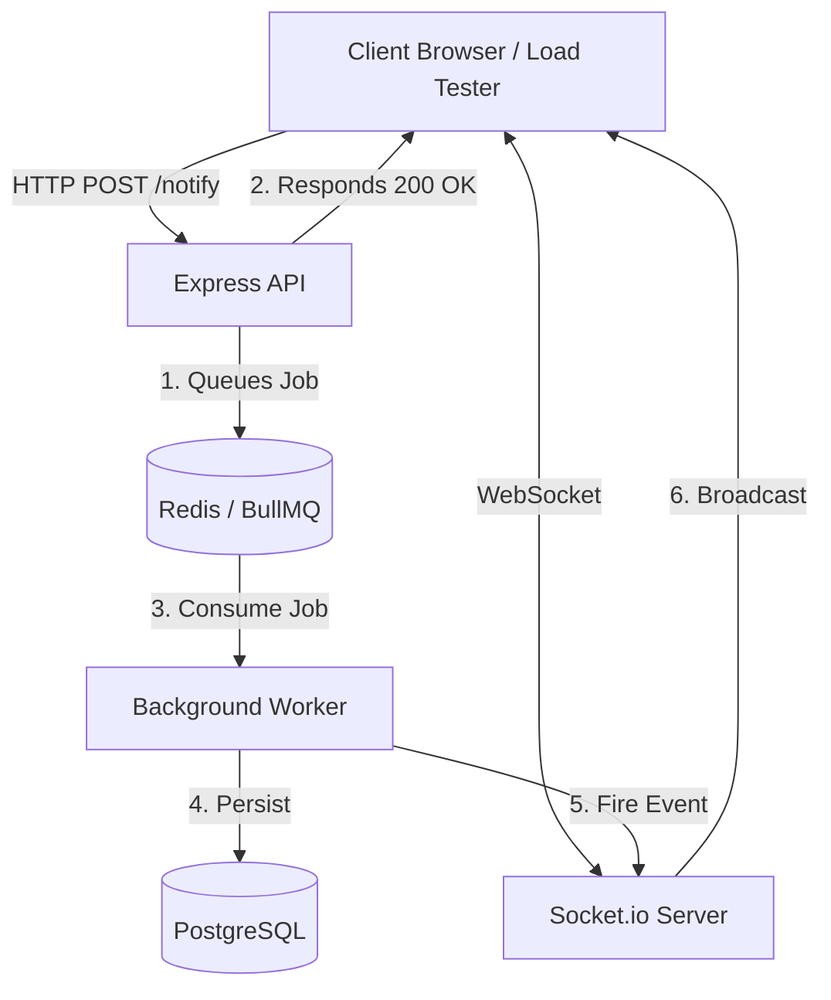

# Distributed Real-Time Notification System

A highly scalable, asynchronous notification microservice built with **Node.js, Redis, BullMQ, PostgreSQL, Prisma, and Socket.io**.

This project was designed as a practical study in **Distributed Systems and System Design**. It specifically tackles the architectural bottlenecks of a traditional single-process REST API when subjected to mass concurrent WebSocket connections and heavy database write loads.

## Architecture

To prevent the Node.js Event Loop from blocking and to protect the PostgreSQL database from connection exhaustion, this architecture decouples the API ingestion from the database persistence layer using an asynchronous message queue.



## The Problem Solved
If an Express API attempts to process 10,000 concurrent notification requests and save them to a database simultaneously:
1. The PostgreSQL connection pool will exhaust, crashing the database.
2. The Node.js event loop will block, causing WebSocket handshakes to time out (`ECONNREFUSED` / `timeout`).

## The Solution
1. **Shock Absorption**: The API acts purely as an ingestion layer. It takes the payload, dumps it into Redis (which can handle >100k ops/sec), and immediately returns a `200 OK`. 
2. **Asynchronous Processing**: A separate worker process consumes the Redis queue at a rate the database can safely handle.
3. **Real-time Callbacks**: Once the worker successfully saves the data, it triggers a WebSocket broadcast to notify the connected clients instantly.

## Tech Stack
* **Backend**: Node.js, Express.js
* **Real-time**: Socket.io
* **Message Broker**: Redis, BullMQ
* **Database**: PostgreSQL, Prisma ORM
* **Infrastructure**: Docker, Docker Compose

## Running the Architecture

### 1. Start Infrastructure (Redis & PostgreSQL)
```bash
docker-compose up -d
npx prisma db push
```

### 2a. Single Process (Development)
Open two separate terminals:
```bash
# Terminal 1: Ingestion API & WebSockets
npm start

# Terminal 2: Background Job Processor
node worker.js
```

### 2b. Clustered Mode (Production-like)
Uses PM2 to spawn 4 API server instances + 1 background worker, all sharing the Redis Pub/Sub adapter as a communication backbone.
```bash
# Install PM2 globally (one time only)
npm install -g pm2

# Boot the full cluster
pm2 start ecosystem.config.js

# Monitor all processes in real-time
pm2 monit
```

## Monitoring the Queue
A visual Bull Board dashboard is available to inspect queued, active, completed, and failed jobs:
```
http://localhost:3000/admin/queues
```

## Stress Testing the System
A custom load-testing script simulates a stampede of **5,000 concurrent WebSockets** and **10,000 HTTP POST requests**:
```bash
node load-test.js
```

> **Note on Windows:** PM2 Cluster Mode on Windows binds to IPv6 by default. The load tester is pre-configured to use `localhost` which resolves correctly. If you experience `ECONNREFUSED` errors, this is a local OS-level TCP port limit — not an application bug. This system is designed for and performs best on Linux-based deployments (e.g., AWS EC2, DigitalOcean Droplets), where enterprise-grade load balancers like **Nginx** sit in front of the Node.js cluster.

## Consistency Guarantee
Notifications are broadcast to WebSocket clients **only after** successful database persistence. The broadcast is triggered by the `QueueEvents` listener in `server.js` on job completion — never optimistically from the API layer.
