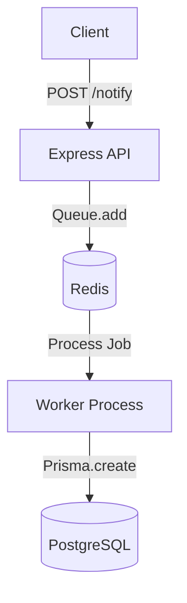

# Real-Time Notification System

A backend notification service built with Node.js, Redis, BullMQ, PostgreSQL, and Prisma.

The goal of this project was to explore asynchronous system design and understand how production systems handle background tasks without blocking incoming requests.

Instead of writing directly to the database from the API, notifications are pushed to a queue and processed by a separate worker. This decouples request handling from database operations and improves reliability.

## Architecture

The application consists of two independent services:

1. **API Server**

   * Receives HTTP requests.
   * Pushes notification jobs to Redis using BullMQ.

2. **Worker Process**

   * Consumes jobs from the queue.
   * Persists notifications to PostgreSQL using Prisma.



## Why I Built This

Most applications start with synchronous REST APIs where a request directly interacts with the database. I wanted to explore a more scalable approach by introducing a message queue between the API and persistence layer.

This project helped me understand concepts such as:

* Asynchronous processing
* Message queues
* Worker-based architectures
* Retry strategies
* Fault tolerance in distributed systems

## Technical Decisions

### BullMQ over Redis Pub/Sub

I initially considered Redis Pub/Sub, but Pub/Sub does not persist messages. If a worker crashes while offline, messages can be lost.

BullMQ was a better choice because it provides:

* Persistent jobs
* Retries
* Delayed execution
* Failure handling

### Retry Strategy

Database operations can fail due to temporary outages or network issues.

To improve reliability, failed jobs are retried using exponential backoff:

* 1st retry → 1 second
* 2nd retry → 2 seconds
* 3rd retry → 4 seconds

This prevents the worker from overwhelming the database during failures.

### Failed Job Handling

Jobs that exceed their retry limit are captured through BullMQ's failed event listener.

This prevents endless retry loops and makes debugging easier.

## Tech Stack

* Node.js
* Express
* Redis
* BullMQ
* PostgreSQL
* Prisma ORM
* Docker

## Running Locally

### Prerequisites

* Docker
* Node.js

### 1. Start Redis and PostgreSQL

```bash
docker-compose up -d
```

### 2. Apply the database schema

```bash
npx prisma db push
```

### 3. Start the API server

```bash
npm start
```

### 4. Start the worker process

```bash
npm run worker
```

### 5. Test the API

```bash
curl -X POST http://localhost:3000/notify \
-H "Content-Type: application/json" \
-d '{"message": "Testing the worker queue"}'
```

If everything is configured correctly, the notification will be queued in Redis and eventually persisted to PostgreSQL by the worker process.
